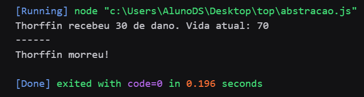
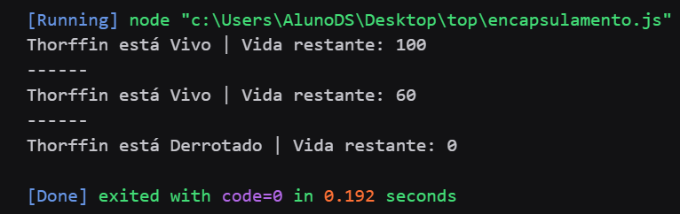
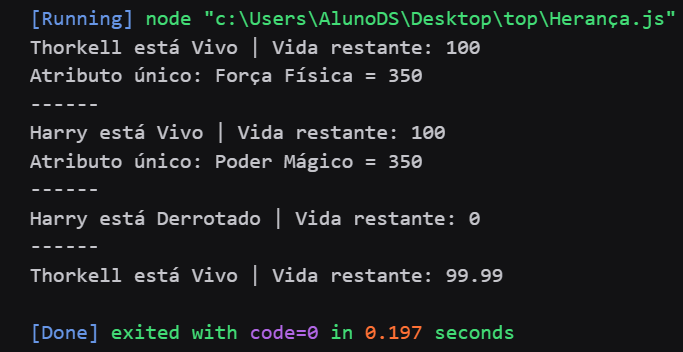
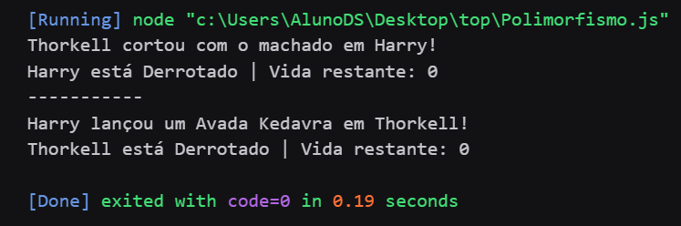
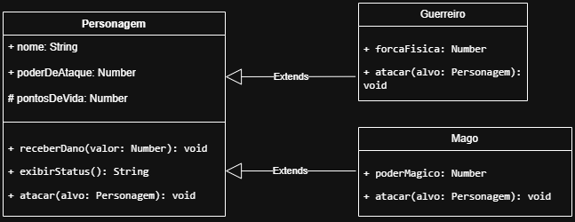

# ⚔️ RPG Character System - OOP Fundamentals

A robust JavaScript implementation of an RPG combat engine designed to showcase the four fundamental pillars of **Object-Oriented Programming (OOP)**.

## Technologies
* **JavaScript (ES6+)**
* **Node.js** (for terminal execution)

## Applied Concepts

This project was built to demonstrate clean code practices through OOP principles:

1.  **Abstraction:** The base `Personagem` (Character) class serves as a blueprint, defining essential attributes and behaviors for any game entity.
2.  **Encapsulation:** Implementation of private fields (`#pontosDeVida`) to ensure character health cannot be manipulated directly from outside the class, protecting the game logic integrity.
3.  **Inheritance:** Specialized classes like `Guerreiro` and `Mago` extend the parent class, reusing code efficiently while adding unique traits.
4.  **Polymorphism:** The `atacar()` (attack) method is overridden in subclasses to provide specific combat logic, such as physical force calculations or magical power multipliers.

## 🎮 How It Works

The system allows the creation of specialized heroes that interact through a method-based combat system.

### Quick Preview:

```javascript
const guerreiro = new Guerreiro('Thorkell', 150, 350);
const mago = new Mago('Harry', 20, 350);

guerreiro.atacar(mago);
mago.atacar(guerreiro);

console.log(guerreiro.exibirStatus());
console.log(mago.exibirStatus());

```

## 📸 Execution Previews

Here you can see the terminal output for each stage of the project development, demonstrating the OOP pillars in action:

<h2 align="center">🖥️ Project Previews</h2>

<p align="center">
  <table>
    <tr>
      <td align="center">
        <strong>Abstraction</strong><br>
        
      </td>
      <td align="center">
        <strong>Encapsulation</strong><br>
        
      </td>
    </tr>
    <tr>
      <td align="center">
        <strong>Inheritance</strong><br>
        
      </td>
      <td align="center">
        <strong>Polymorphism</strong><br>
        
      </td>
    </tr>
  </table>
</p>

<h2 align="center">📊 System Architecture & Previews</h2>

<p align="center">
  <table align="center">
    <tr>
      <td colspan="2" align="center">
        <strong>Class Diagram (UML)</strong><br>
        
      </td>
    </tr>
